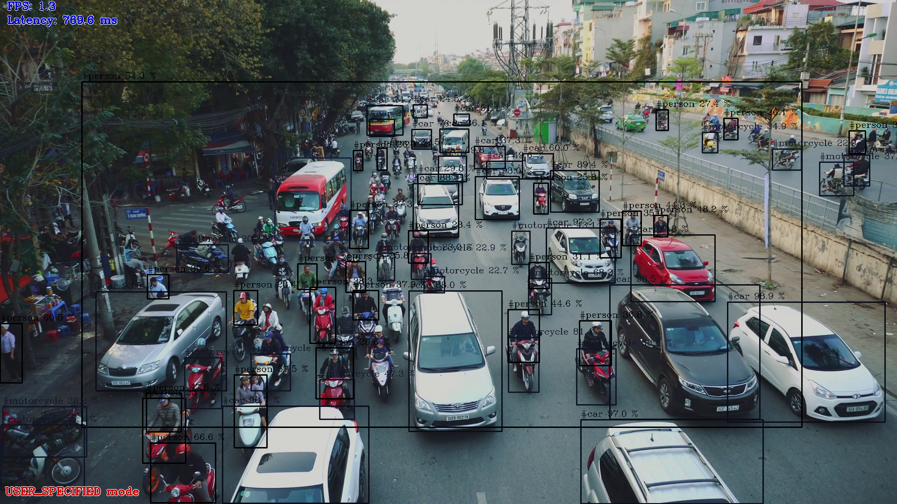

# OpenVINO-YOLO-Automatic-Generation

This repos parses yolov3/yolov3-spp/yolov4/[yolov4-tiny/yolov4-tiny-3l](https://github.com/TNTWEN/OpenVINO-YOLO-Automatic-Generation/tree/master/yolov4tiny)'s . cfg file to automatically generate tensorflow1.x code

As long as you have the .cfg file，you can convert it to .pb and OpenVINO.
This means that code can be generated automatically even if the model(.cfg and .weights) is changed

# Environment
python3.x    (test on python3.6.5)

OpenVINO2020R4 :https://docs.openvinotoolkit.org/latest/index.html

Win or Ubuntu

Tensorflow 1.12.0
# How to use
You could use changed yolov3.cfg ,yolov3-spp.cfg,yolov4.cfg
And i will use original yolov3.cfg and yolov4.cfg as a demonstration. 
And i will show all the details to help you understand this repos!


## yolov3-spp


For example:
yolov3-spp

```
python parse_config.py --cfg cfg/yolov3-spp.cfg

```
you will get the output like this:
```
inputs = _conv2d_fixed_padding(inputs, 32, 3,strides=1)
inputs = _conv2d_fixed_padding(inputs, 64, 3,strides=2)
shortcut=inputs
inputs = _conv2d_fixed_padding(inputs, 32, 1,strides=1)
inputs = _conv2d_fixed_padding(inputs, 64, 3,strides=1)
inputs = inputs + shortcut
inputs = _conv2d_fixed_padding(inputs, 128, 3,strides=2)
shortcut=inputs
inputs = _conv2d_fixed_padding(inputs, 64, 1,strides=1)
inputs = _conv2d_fixed_padding(inputs, 128, 3,strides=1)
inputs = inputs + shortcut
shortcut=inputs
inputs = _conv2d_fixed_padding(inputs, 64, 1,strides=1)
inputs = _conv2d_fixed_padding(inputs, 128, 3,strides=1)
inputs = inputs + shortcut
inputs = _conv2d_fixed_padding(inputs, 256, 3,strides=2)
shortcut=inputs
inputs = _conv2d_fixed_padding(inputs, 128, 1,strides=1)
inputs = _conv2d_fixed_padding(inputs, 256, 3,strides=1)
inputs = inputs + shortcut
shortcut=inputs
inputs = _conv2d_fixed_padding(inputs, 128, 1,strides=1)
inputs = _conv2d_fixed_padding(inputs, 256, 3,strides=1)
inputs = inputs + shortcut
shortcut=inputs
inputs = _conv2d_fixed_padding(inputs, 128, 1,strides=1)
inputs = _conv2d_fixed_padding(inputs, 256, 3,strides=1)
inputs = inputs + shortcut
shortcut=inputs
inputs = _conv2d_fixed_padding(inputs, 128, 1,strides=1)
inputs = _conv2d_fixed_padding(inputs, 256, 3,strides=1)
inputs = inputs + shortcut
shortcut=inputs
inputs = _conv2d_fixed_padding(inputs, 128, 1,strides=1)
inputs = _conv2d_fixed_padding(inputs, 256, 3,strides=1)
inputs = inputs + shortcut
shortcut=inputs
inputs = _conv2d_fixed_padding(inputs, 128, 1,strides=1)
inputs = _conv2d_fixed_padding(inputs, 256, 3,strides=1)
inputs = inputs + shortcut
shortcut=inputs
inputs = _conv2d_fixed_padding(inputs, 128, 1,strides=1)
inputs = _conv2d_fixed_padding(inputs, 256, 3,strides=1)
inputs = inputs + shortcut
shortcut=inputs
inputs = _conv2d_fixed_padding(inputs, 128, 1,strides=1)
inputs = _conv2d_fixed_padding(inputs, 256, 3,strides=1)
inputs = inputs + shortcut
route36=inputs
inputs = _conv2d_fixed_padding(inputs, 512, 3,strides=2)
shortcut=inputs
inputs = _conv2d_fixed_padding(inputs, 256, 1,strides=1)
inputs = _conv2d_fixed_padding(inputs, 512, 3,strides=1)
inputs = inputs + shortcut
shortcut=inputs
inputs = _conv2d_fixed_padding(inputs, 256, 1,strides=1)
inputs = _conv2d_fixed_padding(inputs, 512, 3,strides=1)
inputs = inputs + shortcut
shortcut=inputs
inputs = _conv2d_fixed_padding(inputs, 256, 1,strides=1)
inputs = _conv2d_fixed_padding(inputs, 512, 3,strides=1)
inputs = inputs + shortcut
shortcut=inputs
inputs = _conv2d_fixed_padding(inputs, 256, 1,strides=1)
inputs = _conv2d_fixed_padding(inputs, 512, 3,strides=1)
inputs = inputs + shortcut
shortcut=inputs
inputs = _conv2d_fixed_padding(inputs, 256, 1,strides=1)
inputs = _conv2d_fixed_padding(inputs, 512, 3,strides=1)
inputs = inputs + shortcut
shortcut=inputs
inputs = _conv2d_fixed_padding(inputs, 256, 1,strides=1)
inputs = _conv2d_fixed_padding(inputs, 512, 3,strides=1)
inputs = inputs + shortcut
shortcut=inputs
inputs = _conv2d_fixed_padding(inputs, 256, 1,strides=1)
inputs = _conv2d_fixed_padding(inputs, 512, 3,strides=1)
inputs = inputs + shortcut
shortcut=inputs
inputs = _conv2d_fixed_padding(inputs, 256, 1,strides=1)
inputs = _conv2d_fixed_padding(inputs, 512, 3,strides=1)
inputs = inputs + shortcut
route61=inputs
inputs = _conv2d_fixed_padding(inputs, 1024, 3,strides=2)
shortcut=inputs
inputs = _conv2d_fixed_padding(inputs, 512, 1,strides=1)
inputs = _conv2d_fixed_padding(inputs, 1024, 3,strides=1)
inputs = inputs + shortcut
shortcut=inputs
inputs = _conv2d_fixed_padding(inputs, 512, 1,strides=1)
inputs = _conv2d_fixed_padding(inputs, 1024, 3,strides=1)
inputs = inputs + shortcut
shortcut=inputs
inputs = _conv2d_fixed_padding(inputs, 512, 1,strides=1)
inputs = _conv2d_fixed_padding(inputs, 1024, 3,strides=1)
inputs = inputs + shortcut
shortcut=inputs
inputs = _conv2d_fixed_padding(inputs, 512, 1,strides=1)
inputs = _conv2d_fixed_padding(inputs, 1024, 3,strides=1)
inputs = inputs + shortcut
inputs = _conv2d_fixed_padding(inputs, 512, 1,strides=1)
inputs = _conv2d_fixed_padding(inputs, 1024, 3,strides=1)
inputs = _conv2d_fixed_padding(inputs, 512, 1,strides=1)
route77=inputs
maxpool78=slim.max_pool2d(inputs, 5, 1, 'SAME')
inputs=route77
maxpool80=slim.max_pool2d(inputs, 9, 1, 'SAME')
inputs=route77
maxpool82=slim.max_pool2d(inputs, 13, 1, 'SAME')
inputs=tf.concat([maxpool82,maxpool80,maxpool78,route77],axis=1 if data_format == 'NCHW' else 3)
inputs = _conv2d_fixed_padding(inputs, 512, 1,strides=1)
inputs = _conv2d_fixed_padding(inputs, 1024, 3,strides=1)
inputs = _conv2d_fixed_padding(inputs, 512, 1,strides=1)
route86=inputs
inputs = _conv2d_fixed_padding(inputs, 1024, 3,strides=1)
detect_1 = _detection_layer(inputs, num_classes, _ANCHORS[6:9], img_size, data_format)
detect_1 = tf.identity(detect_1, name='detect_1')
inputs=route86
inputs = _conv2d_fixed_padding(inputs, 256, 1,strides=1)
inputs = _upsample(inputs,route61.get_shape().as_list(),data_format)
route92=inputs
inputs=tf.concat([route92,route61],axis=1 if data_format == 'NCHW' else 3)
inputs = _conv2d_fixed_padding(inputs, 256, 1,strides=1)
inputs = _conv2d_fixed_padding(inputs, 512, 3,strides=1)
inputs = _conv2d_fixed_padding(inputs, 256, 1,strides=1)
inputs = _conv2d_fixed_padding(inputs, 512, 3,strides=1)
inputs = _conv2d_fixed_padding(inputs, 256, 1,strides=1)
route98=inputs
inputs = _conv2d_fixed_padding(inputs, 512, 3,strides=1)
detect_2 = _detection_layer(inputs, num_classes, _ANCHORS[3:6], img_size, data_format)
detect_2 = tf.identity(detect_2, name='detect_2')
inputs=route98
inputs = _conv2d_fixed_padding(inputs, 128, 1,strides=1)
inputs = _upsample(inputs,route36.get_shape().as_list(),data_format)
route104=inputs
inputs=tf.concat([route104,route36],axis=1 if data_format == 'NCHW' else 3)
inputs = _conv2d_fixed_padding(inputs, 128, 1,strides=1)
inputs = _conv2d_fixed_padding(inputs, 256, 3,strides=1)
inputs = _conv2d_fixed_padding(inputs, 128, 1,strides=1)
inputs = _conv2d_fixed_padding(inputs, 256, 3,strides=1)
inputs = _conv2d_fixed_padding(inputs, 128, 1,strides=1)
inputs = _conv2d_fixed_padding(inputs, 256, 3,strides=1)
detect_3 = _detection_layer(inputs, num_classes, _ANCHORS[0:3], img_size, data_format)
detect_3 = tf.identity(detect_3, name='detect_3')
detections = tf.concat([detect_1, detect_2, detect_3], axis=1)
detections = tf.identity(detections, name='detections')

```
copy all the output and paste here:
https://github.com/TNTWEN/OpenVINO-YOLO-Automatic-generation/blob/5f58e072c6a065ae8593e2be78f9e92163819637/yolo_v3.py#L173

And i upload yolo_v3.py here demo/yolo_v3.py. I hope it will help you understand easily

Then we can convert .weights -> .pb -> OpenVINO
```
#windows  default OpenVINO path

python convert_weights_pb.py --class_names cfg/coco.names --weights_file yolov3-spp.weights --data_format NHWC

"C:\Program Files (x86)\IntelSWTools\openvino\bin\setupvars.bat"

python "C:\Program Files (x86)\IntelSWTools\openvino_2020.4.287\deployment_tools\model_optimizer\mo.py" --input_model frozen_darknet_yolov3_model.pb --transformations_config yolov3spp.json --batch 1 --reverse_input_channels

python object_detection_demo_yolov3_async.py -i cam -m frozen_darknet_yolov3_model.xml  -d CPU


```

## yolov4


For example:
yolov4 
```
cd yolov4parse
python parse_config.py --cfg cfg/yolov4.cfg

```
the output is
```
inputs = _conv2d_fixed_padding(inputs, 32, 3,strides=1)
inputs = _conv2d_fixed_padding(inputs, 64, 3,strides=2)
route1=inputs
inputs = _conv2d_fixed_padding(inputs, 64, 1,strides=1)
route2=inputs
inputs=route1
inputs = _conv2d_fixed_padding(inputs, 64, 1,strides=1)
shortcut=inputs
inputs = _conv2d_fixed_padding(inputs, 32, 1,strides=1)
inputs = _conv2d_fixed_padding(inputs, 64, 3,strides=1)
inputs = inputs + shortcut
inputs = _conv2d_fixed_padding(inputs, 64, 1,strides=1)
route8=inputs
inputs=tf.concat([route8,route2],axis=1 if data_format == 'NCHW' else 3)
inputs = _conv2d_fixed_padding(inputs, 64, 1,strides=1)
inputs = _conv2d_fixed_padding(inputs, 128, 3,strides=2)
route11=inputs
inputs = _conv2d_fixed_padding(inputs, 64, 1,strides=1)
route12=inputs
inputs=route11
inputs = _conv2d_fixed_padding(inputs, 64, 1,strides=1)
shortcut=inputs
inputs = _conv2d_fixed_padding(inputs, 64, 1,strides=1)
inputs = _conv2d_fixed_padding(inputs, 64, 3,strides=1)
inputs = inputs + shortcut
shortcut=inputs
inputs = _conv2d_fixed_padding(inputs, 64, 1,strides=1)
inputs = _conv2d_fixed_padding(inputs, 64, 3,strides=1)
inputs = inputs + shortcut
inputs = _conv2d_fixed_padding(inputs, 64, 1,strides=1)
route21=inputs
inputs=tf.concat([route21,route12],axis=1 if data_format == 'NCHW' else 3)
inputs = _conv2d_fixed_padding(inputs, 128, 1,strides=1)
inputs = _conv2d_fixed_padding(inputs, 256, 3,strides=2)
route24=inputs
inputs = _conv2d_fixed_padding(inputs, 128, 1,strides=1)
route25=inputs
inputs=route24
inputs = _conv2d_fixed_padding(inputs, 128, 1,strides=1)
shortcut=inputs
inputs = _conv2d_fixed_padding(inputs, 128, 1,strides=1)
inputs = _conv2d_fixed_padding(inputs, 128, 3,strides=1)
inputs = inputs + shortcut
shortcut=inputs
inputs = _conv2d_fixed_padding(inputs, 128, 1,strides=1)
inputs = _conv2d_fixed_padding(inputs, 128, 3,strides=1)
inputs = inputs + shortcut
shortcut=inputs
inputs = _conv2d_fixed_padding(inputs, 128, 1,strides=1)
inputs = _conv2d_fixed_padding(inputs, 128, 3,strides=1)
inputs = inputs + shortcut
shortcut=inputs
inputs = _conv2d_fixed_padding(inputs, 128, 1,strides=1)
inputs = _conv2d_fixed_padding(inputs, 128, 3,strides=1)
inputs = inputs + shortcut
shortcut=inputs
inputs = _conv2d_fixed_padding(inputs, 128, 1,strides=1)
inputs = _conv2d_fixed_padding(inputs, 128, 3,strides=1)
inputs = inputs + shortcut
shortcut=inputs
inputs = _conv2d_fixed_padding(inputs, 128, 1,strides=1)
inputs = _conv2d_fixed_padding(inputs, 128, 3,strides=1)
inputs = inputs + shortcut
shortcut=inputs
inputs = _conv2d_fixed_padding(inputs, 128, 1,strides=1)
inputs = _conv2d_fixed_padding(inputs, 128, 3,strides=1)
inputs = inputs + shortcut
shortcut=inputs
inputs = _conv2d_fixed_padding(inputs, 128, 1,strides=1)
inputs = _conv2d_fixed_padding(inputs, 128, 3,strides=1)
inputs = inputs + shortcut
inputs = _conv2d_fixed_padding(inputs, 128, 1,strides=1)
route52=inputs
inputs=tf.concat([route52,route25],axis=1 if data_format == 'NCHW' else 3)
inputs = _conv2d_fixed_padding(inputs, 256, 1,strides=1)
route54=inputs
inputs = _conv2d_fixed_padding(inputs, 512, 3,strides=2)
route55=inputs
inputs = _conv2d_fixed_padding(inputs, 256, 1,strides=1)
route56=inputs
inputs=route55
inputs = _conv2d_fixed_padding(inputs, 256, 1,strides=1)
shortcut=inputs
inputs = _conv2d_fixed_padding(inputs, 256, 1,strides=1)
inputs = _conv2d_fixed_padding(inputs, 256, 3,strides=1)
inputs = inputs + shortcut
shortcut=inputs
inputs = _conv2d_fixed_padding(inputs, 256, 1,strides=1)
inputs = _conv2d_fixed_padding(inputs, 256, 3,strides=1)
inputs = inputs + shortcut
shortcut=inputs
inputs = _conv2d_fixed_padding(inputs, 256, 1,strides=1)
inputs = _conv2d_fixed_padding(inputs, 256, 3,strides=1)
inputs = inputs + shortcut
shortcut=inputs
inputs = _conv2d_fixed_padding(inputs, 256, 1,strides=1)
inputs = _conv2d_fixed_padding(inputs, 256, 3,strides=1)
inputs = inputs + shortcut
shortcut=inputs
inputs = _conv2d_fixed_padding(inputs, 256, 1,strides=1)
inputs = _conv2d_fixed_padding(inputs, 256, 3,strides=1)
inputs = inputs + shortcut
shortcut=inputs
inputs = _conv2d_fixed_padding(inputs, 256, 1,strides=1)
inputs = _conv2d_fixed_padding(inputs, 256, 3,strides=1)
inputs = inputs + shortcut
shortcut=inputs
inputs = _conv2d_fixed_padding(inputs, 256, 1,strides=1)
inputs = _conv2d_fixed_padding(inputs, 256, 3,strides=1)
inputs = inputs + shortcut
shortcut=inputs
inputs = _conv2d_fixed_padding(inputs, 256, 1,strides=1)
inputs = _conv2d_fixed_padding(inputs, 256, 3,strides=1)
inputs = inputs + shortcut
inputs = _conv2d_fixed_padding(inputs, 256, 1,strides=1)
route83=inputs
inputs=tf.concat([route83,route56],axis=1 if data_format == 'NCHW' else 3)
inputs = _conv2d_fixed_padding(inputs, 512, 1,strides=1)
route85=inputs
inputs = _conv2d_fixed_padding(inputs, 1024, 3,strides=2)
route86=inputs
inputs = _conv2d_fixed_padding(inputs, 512, 1,strides=1)
route87=inputs
inputs=route86
inputs = _conv2d_fixed_padding(inputs, 512, 1,strides=1)
shortcut=inputs
inputs = _conv2d_fixed_padding(inputs, 512, 1,strides=1)
inputs = _conv2d_fixed_padding(inputs, 512, 3,strides=1)
inputs = inputs + shortcut
shortcut=inputs
inputs = _conv2d_fixed_padding(inputs, 512, 1,strides=1)
inputs = _conv2d_fixed_padding(inputs, 512, 3,strides=1)
inputs = inputs + shortcut
shortcut=inputs
inputs = _conv2d_fixed_padding(inputs, 512, 1,strides=1)
inputs = _conv2d_fixed_padding(inputs, 512, 3,strides=1)
inputs = inputs + shortcut
shortcut=inputs
inputs = _conv2d_fixed_padding(inputs, 512, 1,strides=1)
inputs = _conv2d_fixed_padding(inputs, 512, 3,strides=1)
inputs = inputs + shortcut
inputs = _conv2d_fixed_padding(inputs, 512, 1,strides=1)
route102=inputs
inputs=tf.concat([route102,route87],axis=1 if data_format == 'NCHW' else 3)
inputs = _conv2d_fixed_padding(inputs, 1024, 1,strides=1)
************************************
inputs = _conv2d_fixed_padding(inputs, 512, 1,strides=1)
inputs = _conv2d_fixed_padding(inputs, 1024, 3,strides=1)
inputs = _conv2d_fixed_padding(inputs, 512, 1,strides=1)
route107=inputs
maxpool108=slim.max_pool2d(inputs, 5, 1, 'SAME')
inputs=route107
maxpool110=slim.max_pool2d(inputs, 9, 1, 'SAME')
inputs=route107
maxpool112=slim.max_pool2d(inputs, 13, 1, 'SAME')
inputs=tf.concat([maxpool112,maxpool110,maxpool108,route107],axis=1 if data_format == 'NCHW' else 3)
inputs = _conv2d_fixed_padding(inputs, 512, 1,strides=1)
inputs = _conv2d_fixed_padding(inputs, 1024, 3,strides=1)
inputs = _conv2d_fixed_padding(inputs, 512, 1,strides=1)
route116=inputs
inputs = _conv2d_fixed_padding(inputs, 256, 1,strides=1)
inputs = _upsample(inputs,route85.get_shape().as_list(),data_format)
route118=inputs
inputs=route85
inputs = _conv2d_fixed_padding(inputs, 256, 1,strides=1)
route120=inputs
inputs=tf.concat([route120,route118],axis=1 if data_format == 'NCHW' else 3)
inputs = _conv2d_fixed_padding(inputs, 256, 1,strides=1)
inputs = _conv2d_fixed_padding(inputs, 512, 3,strides=1)
inputs = _conv2d_fixed_padding(inputs, 256, 1,strides=1)
inputs = _conv2d_fixed_padding(inputs, 512, 3,strides=1)
inputs = _conv2d_fixed_padding(inputs, 256, 1,strides=1)
route126=inputs
inputs = _conv2d_fixed_padding(inputs, 128, 1,strides=1)
inputs = _upsample(inputs,route54.get_shape().as_list(),data_format)
route128=inputs
inputs=route54
inputs = _conv2d_fixed_padding(inputs, 128, 1,strides=1)
route130=inputs
inputs=tf.concat([route130,route128],axis=1 if data_format == 'NCHW' else 3)
inputs = _conv2d_fixed_padding(inputs, 128, 1,strides=1)
inputs = _conv2d_fixed_padding(inputs, 256, 3,strides=1)
inputs = _conv2d_fixed_padding(inputs, 128, 1,strides=1)
inputs = _conv2d_fixed_padding(inputs, 256, 3,strides=1)
inputs = _conv2d_fixed_padding(inputs, 128, 1,strides=1)
route136=inputs
inputs = _conv2d_fixed_padding(inputs, 256, 3,strides=1)
detect_1 = _detection_layer(inputs, num_classes, _ANCHORS[0:3], img_size, data_format)
detect_1 = tf.identity(detect_1, name='detect_1')
inputs=route136
inputs = _conv2d_fixed_padding(inputs, 256, 3,strides=2)
route141=inputs
inputs=tf.concat([route141,route126],axis=1 if data_format == 'NCHW' else 3)
inputs = _conv2d_fixed_padding(inputs, 256, 1,strides=1)
inputs = _conv2d_fixed_padding(inputs, 512, 3,strides=1)
inputs = _conv2d_fixed_padding(inputs, 256, 1,strides=1)
inputs = _conv2d_fixed_padding(inputs, 512, 3,strides=1)
inputs = _conv2d_fixed_padding(inputs, 256, 1,strides=1)
route147=inputs
inputs = _conv2d_fixed_padding(inputs, 512, 3,strides=1)
detect_2 = _detection_layer(inputs, num_classes, _ANCHORS[3:6], img_size, data_format)
detect_2 = tf.identity(detect_2, name='detect_2')
inputs=route147
inputs = _conv2d_fixed_padding(inputs, 512, 3,strides=2)
route152=inputs
inputs=tf.concat([route152,route116],axis=1 if data_format == 'NCHW' else 3)
inputs = _conv2d_fixed_padding(inputs, 512, 1,strides=1)
inputs = _conv2d_fixed_padding(inputs, 1024, 3,strides=1)
inputs = _conv2d_fixed_padding(inputs, 512, 1,strides=1)
inputs = _conv2d_fixed_padding(inputs, 1024, 3,strides=1)
inputs = _conv2d_fixed_padding(inputs, 512, 1,strides=1)
inputs = _conv2d_fixed_padding(inputs, 1024, 3,strides=1)
detect_3 = _detection_layer(inputs, num_classes, _ANCHORS[6:9], img_size, data_format)
detect_3 = tf.identity(detect_3, name='detect_3')
detections = tf.concat([detect_1, detect_2, detect_3], axis=1)
detections = tf.identity(detections, name='detections')


```

this line ```************************************``` divides the output into two parts
that means the code above this line uses mish activation
copy the code above this line and paste here:
https://github.com/TNTWEN/OpenVINO-YOLO-Automatic-generation/blob/0714d18acf97a9ab6f6539599b6b8f242004d0be/yolov4parse/yolo_v4.py#L170
the  code below this line uses leaky activation
copy the code bellow this line and paste here:
https://github.com/TNTWEN/OpenVINO-YOLO-Automatic-generation/blob/0714d18acf97a9ab6f6539599b6b8f242004d0be/yolov4parse/yolo_v4.py#L186

And i upload yolo_v4.py here demo/yolo_v4.py. I hope it will help you understand easily

Then we can convert .weights -> .pb -> OpenVINO
```
#windows  default OpenVINO path

python convert_weights_pb.py --class_names cfg/coco.names --weights_file yolov4.weights --data_format NHWC

"C:\Program Files (x86)\IntelSWTools\openvino\bin\setupvars.bat"

python "C:\Program Files (x86)\IntelSWTools\openvino_2020.4.287\deployment_tools\model_optimizer\mo.py" --input_model frozen_darknet_yolov4_model.pb --transformations_config yolov4.json --batch 1 --reverse_input_channels

python object_detection_demo_yolov3_async.py -i cam -m frozen_darknet_yolov4_model.xml  -d CPU

```

We could find the result is the same as https://github.com/TNTWEN/OpenVINO-YOLOV4

